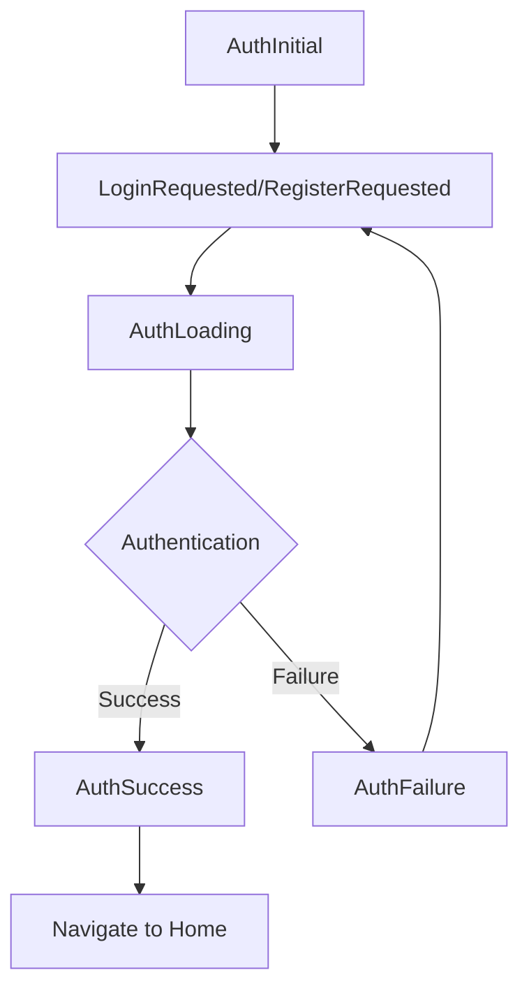

## Overview

The `AuthBloc` manages authentication state using the BLoC (Business Logic Component) pattern. It processes authentication events and emits corresponding states.

## Import

```dart
import 'package:flutter_bloc/flutter_bloc.dart';
import 'package:study_quest/features/auth/presentation/bloc/auth_bloc.dart';
import 'package:study_quest/features/auth/domain/repositories/auth_repository.dart';
```

## Constructor

```dart
AuthBloc({required AuthRepository authRepository})
```

<ParamField path="authRepository" type="AuthRepository" required>
  Repository instance for authentication operations
</ParamField>

## Events

The `AuthBloc` handles the following events:

### LoginRequested

Triggered when a user attempts to login.

```dart
class LoginRequested extends AuthEvent {
  final String email;
  final String password;

  const LoginRequested({
    required this.email,
    required this.password,
  });
}
```

<ParamField path="email" type="String" required>
  User's email address
</ParamField>

<ParamField path="password" type="String" required>
  User's password
</ParamField>

#### Example

<CodeGroup>

```dart Dispatch Event
context.read<AuthBloc>().add(
  LoginRequested(
    email: emailController.text,
    password: passwordController.text,
  ),
);
```

```dart From Button
ElevatedButton(
  onPressed: () {
    final email = emailController.text;
    final password = passwordController.text;
    
    context.read<AuthBloc>().add(
      LoginRequested(
        email: email,
        password: password,
      ),
    );
  },
  child: const Text('Login'),
)
```

</CodeGroup>

---

### RegisterRequested

Triggered when a user attempts to register a new account.

```dart
class RegisterRequested extends AuthEvent {
  final String email;
  final String password;
  final String username;

  const RegisterRequested({
    required this.email,
    required this.password,
    required this.username,
  });
}
```

<ParamField path="email" type="String" required>
  Email for the new account
</ParamField>

<ParamField path="password" type="String" required>
  Password for the new account
</ParamField>

<ParamField path="username" type="String" required>
  Display name for the user
</ParamField>

#### Example

<CodeGroup>

```dart Dispatch Event
context.read<AuthBloc>().add(
  RegisterRequested(
    email: emailController.text,
    password: passwordController.text,
    username: usernameController.text,
  ),
);
```

```dart With Validation
if (formKey.currentState!.validate()) {
  context.read<AuthBloc>().add(
    RegisterRequested(
      email: emailController.text.trim(),
      password: passwordController.text,
      username: usernameController.text.trim(),
    ),
  );
}
```

</CodeGroup>

---

## States

The `AuthBloc` emits the following states:

### AuthInitial

Initial state before any authentication action.

```dart
class AuthInitial extends AuthState {}
```

---

### AuthLoading

Emitted during authentication operations (login/register).

```dart
class AuthLoading extends AuthState {}
```

#### Example

```dart
BlocBuilder<AuthBloc, AuthState>(
  builder: (context, state) {
    if (state is AuthLoading) {
      return const Center(
        child: CircularProgressIndicator(),
      );
    }
    // ... other states
  },
)
```

---

### AuthSuccess

Emitted when authentication succeeds.

```dart
class AuthSuccess extends AuthState {
  final UserEntity user;
  const AuthSuccess(this.user);
}
```

<ResponseField name="user" type="UserEntity">
  The authenticated user entity
</ResponseField>

#### Example

<CodeGroup>

```dart Navigate on Success
BlocListener<AuthBloc, AuthState>(
  listener: (context, state) {
    if (state is AuthSuccess) {
      Navigator.pushReplacementNamed(context, '/home');
    }
  },
  child: LoginForm(),
)
```

```dart Show Welcome Message
BlocListener<AuthBloc, AuthState>(
  listener: (context, state) {
    if (state is AuthSuccess) {
      ScaffoldMessenger.of(context).showSnackBar(
        SnackBar(
          content: Text('Welcome back, ${state.user.username}!'),
          backgroundColor: Colors.green,
        ),
      );
      Navigator.pushReplacementNamed(context, '/home');
    }
  },
  child: LoginForm(),
)
```

</CodeGroup>

---

### AuthFailure

Emitted when authentication fails.

```dart
class AuthFailure extends AuthState {
  final String message;
  const AuthFailure(this.message);
}
```

<ResponseField name="message" type="String">
  Error message describing the failure
</ResponseField>

#### Example

<CodeGroup>

```dart Show Error Message
BlocListener<AuthBloc, AuthState>(
  listener: (context, state) {
    if (state is AuthFailure) {
      ScaffoldMessenger.of(context).showSnackBar(
        SnackBar(
          content: Text(state.message),
          backgroundColor: Colors.red,
        ),
      );
    }
  },
  child: LoginForm(),
)
```

```dart Error Dialog
BlocListener<AuthBloc, AuthState>(
  listener: (context, state) {
    if (state is AuthFailure) {
      showDialog(
        context: context,
        builder: (context) => AlertDialog(
          title: const Text('Authentication Failed'),
          content: Text(state.message),
          actions: [
            TextButton(
              onPressed: () => Navigator.pop(context),
              child: const Text('OK'),
            ),
          ],
        ),
      );
    }
  },
  child: LoginForm(),
)
```

</CodeGroup>

---

## Complete Usage Example

<CodeGroup>

```dart Login Page
class LoginPage extends StatelessWidget {
  final emailController = TextEditingController();
  final passwordController = TextEditingController();

  @override
  Widget build(BuildContext context) {
    return BlocProvider(
      create: (context) => AuthBloc(
        authRepository: getIt<AuthRepository>(),
      ),
      child: Scaffold(
        body: BlocConsumer<AuthBloc, AuthState>(
          listener: (context, state) {
            if (state is AuthSuccess) {
              Navigator.pushReplacementNamed(context, '/home');
            } else if (state is AuthFailure) {
              ScaffoldMessenger.of(context).showSnackBar(
                SnackBar(
                  content: Text(state.message),
                  backgroundColor: Colors.red,
                ),
              );
            }
          },
          builder: (context, state) {
            return Padding(
              padding: const EdgeInsets.all(16.0),
              child: Column(
                mainAxisAlignment: MainAxisAlignment.center,
                children: [
                  TextField(
                    controller: emailController,
                    decoration: const InputDecoration(
                      labelText: 'Email',
                    ),
                  ),
                  TextField(
                    controller: passwordController,
                    obscureText: true,
                    decoration: const InputDecoration(
                      labelText: 'Password',
                    ),
                  ),
                  const SizedBox(height: 20),
                  ElevatedButton(
                    onPressed: state is AuthLoading
                        ? null
                        : () {
                            context.read<AuthBloc>().add(
                              LoginRequested(
                                email: emailController.text,
                                password: passwordController.text,
                              ),
                            );
                          },
                    child: state is AuthLoading
                        ? const CircularProgressIndicator()
                        : const Text('Login'),
                  ),
                ],
              ),
            );
          },
        ),
      ),
    );
  }
}
```

```dart Register Page
class RegisterPage extends StatelessWidget {
  final emailController = TextEditingController();
  final passwordController = TextEditingController();
  final usernameController = TextEditingController();

  @override
  Widget build(BuildContext context) {
    return BlocProvider(
      create: (context) => AuthBloc(
        authRepository: getIt<AuthRepository>(),
      ),
      child: Scaffold(
        body: BlocConsumer<AuthBloc, AuthState>(
          listener: (context, state) {
            if (state is AuthSuccess) {
              Navigator.pushReplacementNamed(context, '/home');
            } else if (state is AuthFailure) {
              ScaffoldMessenger.of(context).showSnackBar(
                SnackBar(content: Text(state.message)),
              );
            }
          },
          builder: (context, state) {
            return Padding(
              padding: const EdgeInsets.all(16.0),
              child: Column(
                mainAxisAlignment: MainAxisAlignment.center,
                children: [
                  TextField(
                    controller: usernameController,
                    decoration: const InputDecoration(
                      labelText: 'Username',
                    ),
                  ),
                  TextField(
                    controller: emailController,
                    decoration: const InputDecoration(
                      labelText: 'Email',
                    ),
                  ),
                  TextField(
                    controller: passwordController,
                    obscureText: true,
                    decoration: const InputDecoration(
                      labelText: 'Password',
                    ),
                  ),
                  const SizedBox(height: 20),
                  ElevatedButton(
                    onPressed: state is AuthLoading
                        ? null
                        : () {
                            context.read<AuthBloc>().add(
                              RegisterRequested(
                                email: emailController.text,
                                password: passwordController.text,
                                username: usernameController.text,
                              ),
                            );
                          },
                    child: state is AuthLoading
                        ? const CircularProgressIndicator()
                        : const Text('Register'),
                  ),
                ],
              ),
            );
          },
        ),
      ),
    );
  }
}
```

</CodeGroup>

## State Flow



## Best Practices

<AccordionGroup>
  <Accordion title="Use BlocProvider at the top level">
    Provide the AuthBloc at the app level to share authentication state across the app.
    
    ```dart
    MaterialApp(
      home: BlocProvider(
        create: (context) => AuthBloc(
          authRepository: getIt<AuthRepository>(),
        ),
        child: const WelcomePage(),
      ),
    )
    ```
  </Accordion>

  <Accordion title="Use BlocListener for navigation">
    Handle navigation and side effects in `BlocListener`, not in the builder.
    
    ```dart
    BlocListener<AuthBloc, AuthState>(
      listener: (context, state) {
        if (state is AuthSuccess) {
          Navigator.pushReplacementNamed(context, '/home');
        }
      },
      child: YourWidget(),
    )
    ```
  </Accordion>

  <Accordion title="Dispose controllers properly">
    Always dispose of TextEditingControllers to prevent memory leaks.
    
    ```dart
    @override
    void dispose() {
      emailController.dispose();
      passwordController.dispose();
      super.dispose();
    }
    ```
  </Accordion>
</AccordionGroup>

## Related Pages

<CardGroup cols={2}>
  <Card title="Auth Overview" icon="shield-halved" href="/api/auth/overview">
    Feature architecture and entities
  </Card>
  <Card title="Auth Repository" icon="database" href="/api/auth/repositories">
    Repository methods and contracts
  </Card>
</CardGroup>