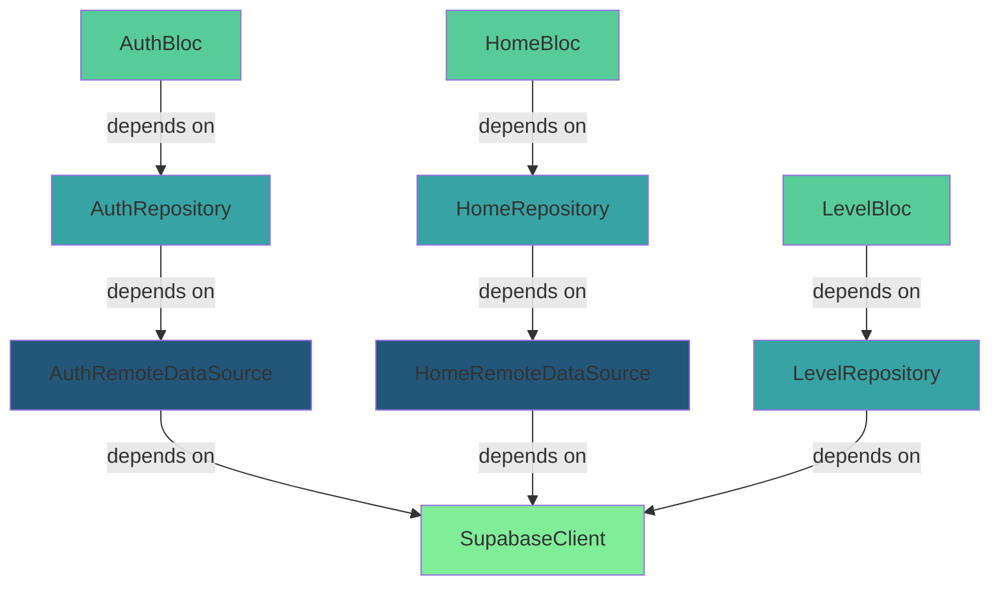

## Overview

StudyQuest uses the **get_it** package as a service locator for dependency injection. This enables loose coupling, testability, and centralized dependency management across features.

**Location:** `/lib/injection_container.dart`

## Dependencies

```yaml pubspec.yaml
dependencies:
  get_it: ^7.6.0
  supabase_flutter: ^2.0.0
```

## Service Locator Instance

<CodeGroup>
```dart Global Instance
import 'package:get_it/get_it.dart';

final sl = GetIt.instance; // Service Locator
```

```dart Usage in Widgets
import 'package:studyquest/injection_container.dart';

class LoginScreen extends StatelessWidget {
  @override
  Widget build(BuildContext context) {
    return BlocProvider(
      create: (_) => sl<AuthBloc>(),
      child: LoginForm(),
    );
  }
}
```
</CodeGroup>

The `sl` constant provides global access to all registered dependencies throughout the app.

## Initialization

### init()

Registers all dependencies including BLoCs, repositories, data sources, and external services.

<CodeGroup>
```dart Main.dart Setup
import 'injection_container.dart' as di;

void main() async {
  WidgetsFlutterBinding.ensureInitialized();
  
  // Initialize Supabase
  await Supabase.initialize(
    url: 'YOUR_SUPABASE_URL',
    anonKey: 'YOUR_SUPABASE_ANON_KEY',
  );
  
  // Register all dependencies
  await di.init();
  
  runApp(MyApp());
}
```

```dart Full Implementation
Future<void> init() async {
  // Features - Auth 
  sl.registerFactory(() => AuthBloc(authRepository: sl()));
  sl.registerLazySingleton<AuthRepository>(
    () => AuthRepositoryImpl(remoteDataSource: sl()),
  );
  sl.registerLazySingleton<AuthRemoteDataSource>(
    () => AuthRemoteDataSourceImpl(supabaseClient: sl()),
  );

  // Features - Home (World/Document List)
  sl.registerFactory(() => HomeBloc(homeRepository: sl()));
  sl.registerLazySingleton<HomeRepository>(
    () => HomeRepositoryImpl(remoteDataSource: sl()),
  );
  sl.registerLazySingleton<HomeRemoteDataSource>(
    () => HomeRemoteDataSourceImpl(supabaseClient: sl()),
  );

  // Features - Levels / Level Map
  sl.registerFactory(() => LevelBloc(sl()));
  sl.registerLazySingleton(() => LevelRepository(sl()));

  // External (Supabase Client) 
  sl.registerLazySingleton(() => Supabase.instance.client);
}
```
</CodeGroup>

## Registration Patterns

### Factory Registration

Creates a new instance every time the dependency is requested. Ideal for BLoCs and short-lived objects.

<ParamField path="registerFactory" type="T Function()">
  Registers a factory that creates a new instance on each request.
</ParamField>

<CodeGroup>
```dart BLoC Registration
// New AuthBloc instance for each screen
sl.registerFactory(() => AuthBloc(authRepository: sl()));

// New HomeBloc instance when needed
sl.registerFactory(() => HomeBloc(homeRepository: sl()));

// New LevelBloc instance per usage
sl.registerFactory(() => LevelBloc(sl()));
```

```dart Usage
// Each call creates a new BLoC
final authBloc1 = sl<AuthBloc>();
final authBloc2 = sl<AuthBloc>(); // Different instance

BlocProvider(
  create: (_) => sl<AuthBloc>(), // Fresh instance
  child: LoginScreen(),
)
```
</CodeGroup>

<Note>
  **Why Factory for BLoCs?** BLoCs are typically scoped to specific screens or widgets. Creating new instances prevents state from persisting inappropriately across navigation.
</Note>

### Lazy Singleton Registration

Creates a single instance on first use and reuses it for all subsequent requests. Perfect for repositories, services, and clients.

<ParamField path="registerLazySingleton" type="T Function()">
  Registers a lazy singleton that creates one shared instance on first access.
</ParamField>

<CodeGroup>
```dart Repository Registration
// Single repository instance shared across app
sl.registerLazySingleton<AuthRepository>(
  () => AuthRepositoryImpl(remoteDataSource: sl()),
);

sl.registerLazySingleton<HomeRepository>(
  () => HomeRepositoryImpl(remoteDataSource: sl()),
);

sl.registerLazySingleton(() => LevelRepository(sl()));
```

```dart Data Source Registration
// Single data source per feature
sl.registerLazySingleton<AuthRemoteDataSource>(
  () => AuthRemoteDataSourceImpl(supabaseClient: sl()),
);

sl.registerLazySingleton<HomeRemoteDataSource>(
  () => HomeRemoteDataSourceImpl(supabaseClient: sl()),
);
```

```dart External Services
// Single Supabase client for entire app
sl.registerLazySingleton(() => Supabase.instance.client);
```
</CodeGroup>

<Note>
  **Why Singleton for Repositories?** Repositories manage data access and may cache results. Using singletons ensures consistent state and avoids redundant network calls.
</Note>

## Dependency Graph

The following diagram shows how dependencies flow through the architecture:



## Feature Registration

### Authentication Feature

<ResponseField name="AuthBloc" type="Factory">
  Manages authentication state and events.
  
  **Dependencies:** `AuthRepository`
  
  **Lifetime:** New instance per widget
</ResponseField>

<ResponseField name="AuthRepository" type="Lazy Singleton">
  Interface for authentication operations.
  
  **Implementation:** `AuthRepositoryImpl`
  
  **Dependencies:** `AuthRemoteDataSource`
</ResponseField>

<ResponseField name="AuthRemoteDataSource" type="Lazy Singleton">
  Handles authentication API calls.
  
  **Implementation:** `AuthRemoteDataSourceImpl`
  
  **Dependencies:** `SupabaseClient`
</ResponseField>

<CodeGroup>
```dart Feature Usage
import 'package:studyquest/injection_container.dart';

class LoginScreen extends StatelessWidget {
  @override
  Widget build(BuildContext context) {
    return BlocProvider(
      create: (_) => sl<AuthBloc>(),
      child: BlocBuilder<AuthBloc, AuthState>(
        builder: (context, state) {
          // UI based on auth state
        },
      ),
    );
  }
}
```
</CodeGroup>

### Home Feature

<ResponseField name="HomeBloc" type="Factory">
  Manages home screen state and world/document lists.
  
  **Dependencies:** `HomeRepository`
  
  **Lifetime:** New instance per screen
</ResponseField>

<ResponseField name="HomeRepository" type="Lazy Singleton">
  Interface for fetching worlds and documents.
  
  **Implementation:** `HomeRepositoryImpl`
  
  **Dependencies:** `HomeRemoteDataSource`
</ResponseField>

<ResponseField name="HomeRemoteDataSource" type="Lazy Singleton">
  Handles home data API calls.
  
  **Implementation:** `HomeRemoteDataSourceImpl`
  
  **Dependencies:** `SupabaseClient`
</ResponseField>

### Levels Feature

<ResponseField name="LevelBloc" type="Factory">
  Manages level map state and progression.
  
  **Dependencies:** `LevelRepository`
  
  **Lifetime:** New instance per usage
</ResponseField>

<ResponseField name="LevelRepository" type="Lazy Singleton">
  Retrieves flashcards and quizzes for levels.
  
  **Dependencies:** `SupabaseClient` (direct)
  
  **Note:** Unlike other repositories, this depends directly on Supabase client
</ResponseField>

### External Services

<ResponseField name="SupabaseClient" type="Lazy Singleton">
  Singleton Supabase client for database and auth operations.
  
  **Source:** `Supabase.instance.client`
  
  **Shared by:** All data sources and level repository
</ResponseField>

## Best Practices

<AccordionGroup>
  <Accordion title="Follow Clean Architecture Layers">
    Register dependencies following the layer pattern:
    
    1. **Presentation Layer** (Factory) - BLoCs, Cubits
    2. **Domain Layer** (Lazy Singleton) - Repository interfaces
    3. **Data Layer** (Lazy Singleton) - Repository implementations, Data sources
    4. **External** (Lazy Singleton) - Third-party clients
    
    ```dart
    // ✅ Good - follows layer pattern
    sl.registerFactory(() => MyBloc(repository: sl()));
    sl.registerLazySingleton<MyRepository>(() => MyRepositoryImpl(sl()));
    sl.registerLazySingleton<MyDataSource>(() => MyDataSourceImpl(sl()));
    ```
  </Accordion>

  <Accordion title="Use Interface Types for Repositories">
    Register repositories using their abstract interface type to enable easy mocking and testing:
    
    ```dart
    // ✅ Good - uses interface type
    sl.registerLazySingleton<AuthRepository>(
      () => AuthRepositoryImpl(remoteDataSource: sl()),
    );
    
    // ❌ Avoid - uses concrete type
    sl.registerLazySingleton<AuthRepositoryImpl>(
      () => AuthRepositoryImpl(remoteDataSource: sl()),
    );
    ```
  </Accordion>

  <Accordion title="Initialize Before runApp()">
    Always call `init()` before running your app to ensure all dependencies are registered:
    
    ```dart
    void main() async {
      WidgetsFlutterBinding.ensureInitialized();
      await Supabase.initialize(...);
      await di.init(); // ← Register dependencies first
      runApp(MyApp());
    }
    ```
  </Accordion>

  <Accordion title="Dependency Resolution">
    GetIt resolves dependencies automatically using `sl()` calls:
    
    ```dart
    // Explicit - more readable
    sl.registerFactory(() => AuthBloc(
      authRepository: sl<AuthRepository>(),
    ));
    
    // Implicit - terser
    sl.registerFactory(() => AuthBloc(authRepository: sl()));
    
    // Both work identically
    ```
  </Accordion>
</AccordionGroup>

## Testing with Dependency Injection

<CodeGroup>
```dart Mock Registration
import 'package:mockito/mockito.dart';
import 'package:studyquest/injection_container.dart';

class MockAuthRepository extends Mock implements AuthRepository {}

void main() {
  setUpAll(() async {
    // Initialize dependencies
    await di.init();
  });
  
  setUp(() {
    // Replace with mock for testing
    sl.allowReassignment = true;
    sl.registerLazySingleton<AuthRepository>(() => MockAuthRepository());
  });
  
  test('login success shows home screen', () async {
    final mockRepo = sl<AuthRepository>() as MockAuthRepository;
    
    when(mockRepo.login(any, any))
      .thenAnswer((_) async => Right(user));
    
    final bloc = sl<AuthBloc>();
    // Test bloc behavior
  });
}
```

```dart Widget Testing
import 'package:flutter_test/flutter_test.dart';

void main() {
  testWidgets('LoginScreen shows error on failed login', (tester) async {
    // Setup mocks
    final mockRepo = MockAuthRepository();
    sl.allowReassignment = true;
    sl.registerLazySingleton<AuthRepository>(() => mockRepo);
    
    when(mockRepo.login(any, any))
      .thenAnswer((_) async => Left(ServerFailure()));
    
    // Test widget
    await tester.pumpWidget(MaterialApp(home: LoginScreen()));
    await tester.tap(find.text('Login'));
    await tester.pump();
    
    expect(find.text('Login failed'), findsOneWidget);
  });
}
```
</CodeGroup>

## Adding New Features

When adding a new feature, follow this registration pattern:

<Steps>
  <Step title="Register the BLoC">
    ```dart
    sl.registerFactory(() => NewFeatureBloc(repository: sl()));
    ```
  </Step>
  
  <Step title="Register the Repository">
    ```dart
    sl.registerLazySingleton<NewFeatureRepository>(
      () => NewFeatureRepositoryImpl(remoteDataSource: sl()),
    );
    ```
  </Step>
  
  <Step title="Register the Data Source">
    ```dart
    sl.registerLazySingleton<NewFeatureRemoteDataSource>(
      () => NewFeatureRemoteDataSourceImpl(supabaseClient: sl()),
    );
    ```
  </Step>
  
  <Step title="Use in Widgets">
    ```dart
    BlocProvider(
      create: (_) => sl<NewFeatureBloc>(),
      child: NewFeatureScreen(),
    )
    ```
  </Step>
</Steps>

## See Also

- [get_it Package](https://pub.dev/packages/get_it) - Official documentation
- [Notification Service](/api/core/notifications) - Example of service that could be registered
- [Clean Architecture in Flutter](https://resocoder.com/flutter-clean-architecture) - Architecture guide