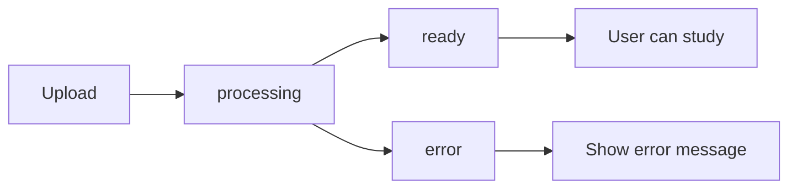

## Overview

The `DocumentEntity` class represents an uploaded PDF document in StudyQuest. It tracks the document's metadata, processing status, and AI-generated content. Each document becomes a "world" in the game interface.

**Source:** `lib/features/home/domain/entities/document_entity.dart:3`

## Properties

<ParamField path="id" type="String" required>
  Unique identifier for the document
</ParamField>

<ParamField path="title" type="String" required>
  Display name of the document
</ParamField>

<ParamField path="fileUrl" type="String" required>
  URL to the uploaded PDF file in storage
</ParamField>

<ParamField path="summary" type="String?">
  AI-generated summary of the document content. Can be null if AI processing is not yet complete.
</ParamField>

<ParamField path="status" type="String" required>
  Current processing status of the document. Possible values:
  - `processing`: AI is analyzing the document
  - `ready`: Document is processed and ready for study
  - `error`: An error occurred during processing
</ParamField>

<ParamField path="uploadDate" type="DateTime" required>
  Timestamp when the document was uploaded
</ParamField>

## Entity Structure

```dart
class DocumentEntity extends Equatable {
  final String id;
  final String title;
  final String fileUrl;
  final String? summary;
  final String status;
  final DateTime uploadDate;

  const DocumentEntity({
    required this.id,
    required this.title,
    required this.fileUrl,
    this.summary,
    required this.status,
    required this.uploadDate,
  });

  @override
  List<Object?> get props => [id, title, fileUrl, status];
}
```

## Model Conversion

### DocumentModel

The `DocumentModel` class extends `DocumentEntity` and provides conversion methods for Supabase integration.

**Source:** `lib/features/home/data/models/document_model.dart:3`

#### From JSON (Supabase)

Converts a Supabase row to a `DocumentModel`:

```dart
factory DocumentModel.fromJson(Map<String, dynamic> json) {
  return DocumentModel(
    id: json['id'],
    title: json['title'],
    fileUrl: json['file_url'],
    summary: json['summary_text'], // Note: DB column is 'summary_text'
    status: json['status'] ?? 'processing',
    uploadDate: DateTime.parse(json['created_at']),
  );
}
```

<Note>
  The database column `summary_text` maps to the `summary` property, and `created_at` maps to `uploadDate`.
</Note>

#### To JSON

Converts a `DocumentModel` to JSON for uploading to Supabase:

```dart
Map<String, dynamic> toJson() {
  return {
    'title': title,
    'file_url': fileUrl,
    'status': status,
    // ID and timestamps are auto-generated by Supabase
  };
}
```

## Usage in Repositories

### HomeRepository

**Source:** `lib/features/home/domain/repositories/home_repository.dart:8`

The repository defines methods for document operations:

```dart
abstract class HomeRepository {
  // Get all documents for the current user
  Future<Either<Failure, List<DocumentEntity>>> getMyDocuments();
  
  // Upload a new PDF document
  Future<Either<Failure, DocumentEntity>> uploadDocument(
    File file, 
    String fileName
  );

  // Delete a document
  Future<Either<Failure, void>> deleteDocument(String documentId);
}
```

## Usage in Blocs

### HomeState

**Source:** `lib/features/home/presentation/bloc/home_state.dart:15`

The list of documents is stored in the `HomeLoaded` state:

```dart
class HomeLoaded extends HomeState {
  final List<DocumentEntity> documents;
  final dynamic profile;

  const HomeLoaded(this.documents, {this.profile});

  @override
  List<Object?> get props => [documents, profile];
}
```

## Usage in UI

### HomePage

**Source:** `lib/features/home/presentation/pages/home_page.dart:208`

Documents are displayed as "world cards" in the home interface:

```dart
Widget _buildWorldCard(BuildContext context, DocumentEntity doc) {
  // Displays document as an interactive card
  // Shows title, status, and allows navigation to levels
}
```

### Delete Dialog

**Source:** `lib/features/home/presentation/pages/home_page.dart:62`

```dart
void _showDeleteDialog(BuildContext context, DocumentEntity doc) {
  // Confirms deletion with the user before removing the document
}
```

## Relationships

- **User**: Each document belongs to a user (owner)
- **Levels**: Each document contains multiple `LevelEntity` instances for studying
- **Topics**: AI generates topics from the document which become levels
- **Flashcards & Quizzes**: Generated from the document content for each topic

## Status Workflow



1. **processing**: Document is uploaded, AI is analyzing content
2. **ready**: AI has generated topics, flashcards, and quizzes
3. **error**: Something went wrong during AI processing
