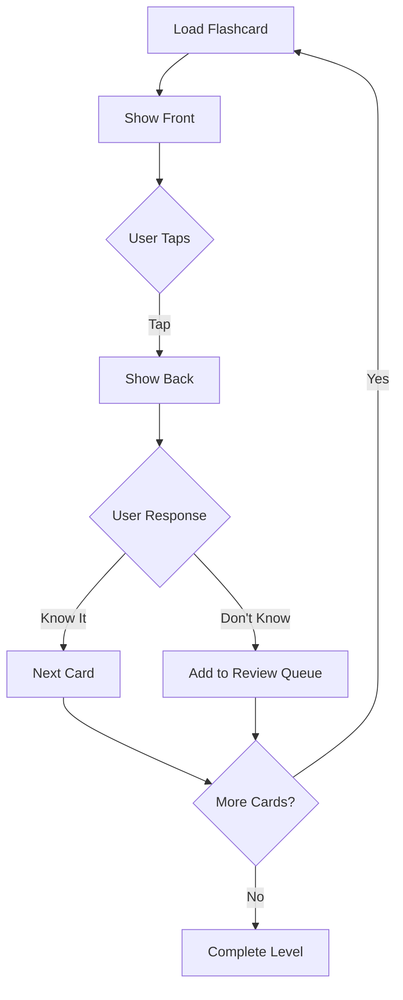

## Overview

The `FlashcardEntity` class represents a single flashcard used for spaced repetition learning. Each flashcard contains a question (front) and answer (back) generated by AI from the document content.

**Source:** `lib/features/home/domain/entities/flashcard_entity.dart:1`

## Properties

<ParamField path="id" type="String" required>
  Unique identifier for the flashcard
</ParamField>

<ParamField path="front" type="String" required>
  The front side of the flashcard (question or prompt)
</ParamField>

<ParamField path="back" type="String" required>
  The back side of the flashcard (answer or explanation)
</ParamField>

## Entity Structure

```dart
class FlashcardEntity {
  final String id;
  final String front; // Question
  final String back;  // Answer

  FlashcardEntity({
    required this.id,
    required this.front,
    required this.back,
  });
}
```

<Note>
  `FlashcardEntity` does not extend `Equatable`, unlike some other entities in the codebase. This may be added in future versions.
</Note>

## Model Conversion

### From Supabase Map

**Source:** `lib/features/home/domain/entities/flashcard_entity.dart:13`

The entity includes a factory constructor for converting from Supabase data:

```dart
factory FlashcardEntity.fromMap(Map<String, dynamic> map) {
  return FlashcardEntity(
    id: map['id'] as String,
    front: map['front_text'] ?? 'Sin texto',
    back: map['back_text'] ?? 'Sin respuesta',
  );
}
```

<Note>
  The database columns `front_text` and `back_text` map to the `front` and `back` properties. Default values are provided if data is missing.
</Note>

## Database Schema Mapping

| Entity Property | Database Column | Type | Default |
|----------------|-----------------|------|----------|
| `id` | `id` | String | Required |
| `front` | `front_text` | String | "Sin texto" |
| `back` | `back_text` | String | "Sin respuesta" |

## Usage in Repositories

### LevelRepository

**Source:** `lib/features/home/domain/repositories/level_repository.dart:76`

Flashcards are fetched for a specific document and topic:

```dart
Future<List<FlashcardEntity>> getFlashcards(
  String docId, 
  String topicId
) async {
  try {
    // Try to fetch from the specific topic
    final data = await supabase
      .from('flashcards')
      .select()
      .eq('topic_id', topicId);

    if (data.isNotEmpty) {
      return data.map((json) => FlashcardEntity.fromMap(json)).toList();
    }

    // Fallback: fetch any flashcards for this document
    final fallbackData = await supabase
      .from('flashcards')
      .select()
      .eq('document_id', docId)
      .limit(10);

    return fallbackData.map((json) => FlashcardEntity.fromMap(json)).toList();
  } catch (e) {
    throw Exception('Error fetching flashcards: $e');
  }
}
```

<Note>
  The repository implements a fallback strategy: if no flashcards exist for the specific topic, it fetches flashcards from the entire document.
</Note>

## Usage in UI

### FlashcardsPage

**Source:** `lib/features/home/presentation/pages/flashcards_page.dart:27`

Flashcards are managed in a queue for sequential study:

```dart
class _FlashcardsPageState extends State<FlashcardsPage> {
  final Queue<FlashcardEntity> _cardsQueue = Queue();
  FlashcardEntity? _currentCard;
  bool _showAnswer = false;

  @override
  void initState() {
    super.initState();
    // Load flashcards into queue
    _cardsQueue.addAll(widget.flashcards);
    _loadNextCard();
  }

  void _loadNextCard() {
    if (_cardsQueue.isNotEmpty) {
      setState(() {
        _currentCard = _cardsQueue.removeFirst();
        _showAnswer = false;
      });
    }
  }
}
```

## Flashcard Interaction Flow



## Example Usage

Creating a flashcard from Supabase data:

```dart
final flashcardData = {
  'id': 'flash_001',
  'front_text': '¿Qué es la fotosíntesis?',
  'back_text': 'Proceso por el cual las plantas convierten luz solar en energía química',
};

final flashcard = FlashcardEntity.fromMap(flashcardData);

print(flashcard.front); // "¿Qué es la fotosíntesis?"
print(flashcard.back);  // "Proceso por el cual las plantas..."
```

## Relationships

- **Level**: Flashcards belong to levels with type `LevelType.flashcards` or `LevelType.mixed`
- **Topic**: Each flashcard is generated from a specific topic within a document
- **Document**: Flashcards are ultimately derived from document content

## AI Generation

Flashcards are automatically generated by AI when a document is uploaded:

1. Document is analyzed for key concepts
2. Topics are extracted
3. For each topic, multiple flashcards are generated
4. Flashcards are stored in the `flashcards` table in Supabase
5. Retrieved and displayed in flashcard-type levels

## Best Practices

- **Front side**: Should be clear, concise questions or prompts
- **Back side**: Should provide complete, accurate answers with context
- **Length**: Keep both sides brief (1-3 sentences) for optimal learning
- **Clarity**: Avoid ambiguous questions that could have multiple interpretations
