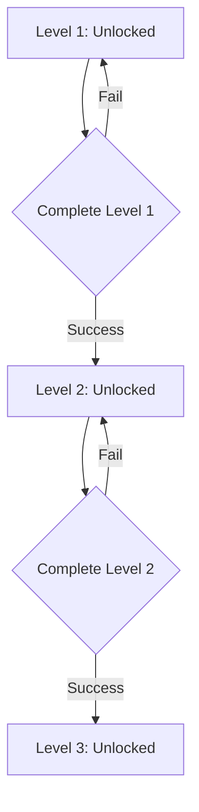

## Overview

The `LevelEntity` class represents a study level or stage within a document. Each level corresponds to a topic extracted from the document and contains either flashcards, quizzes, or a mix of both. Levels form the core progression system in StudyQuest.

**Source:** `lib/features/home/domain/entities/level_entity.dart:3`

## LevelType Enum

**Source:** `lib/features/home/domain/entities/level_entity.dart:1`

```dart
enum LevelType { 
  flashcards, // Flashcard practice level
  quiz,       // Multiple-choice quiz level
  mixed,      // Combination of flashcards and quizzes
  exam        // Final exam level
}
```

## Properties

<ParamField path="id" type="String" required>
  Unique identifier for the level
</ParamField>

<ParamField path="title" type="String" required>
  Display name of the level (usually the topic name)
</ParamField>

<ParamField path="type" type="LevelType" required>
  Type of content in this level: `flashcards`, `quiz`, `mixed`, or `exam`
</ParamField>

<ParamField path="isLocked" type="bool" default="false">
  Whether the level is locked and cannot be accessed yet. Typically unlocked by completing previous levels.
</ParamField>

<ParamField path="isCompleted" type="bool" default="false">
  Whether the user has successfully completed this level
</ParamField>

<ParamField path="difficulty" type="int" default="1">
  Difficulty rating from 1 to 5 stars
</ParamField>

## Entity Structure

```dart
class LevelEntity {
  final String id;
  final String title;
  final LevelType type;
  final bool isLocked;
  final bool isCompleted;
  final int difficulty; // 1 to 5 stars

  const LevelEntity({
    required this.id,
    required this.title,
    required this.type,
    this.isLocked = false,
    this.isCompleted = false,
    this.difficulty = 1,
  });
}
```

<Note>
  Unlike other entities, `LevelEntity` does not extend `Equatable`. This may be added in future versions for better state comparison.
</Note>

## Model Conversion

### LevelModel

The `LevelModel` class extends `LevelEntity` and provides conversion from AI-generated topics.

**Source:** `lib/features/home/data/models/level_model.dart:3`

#### From Topic JSON

Converts an AI-generated topic to a `LevelModel`:

```dart
factory LevelModel.fromTopicJson(Map<String, dynamic> json, int index) {
  // Alternate between flashcards and quiz types
  final isFlashcard = index % 2 == 0; 
  
  return LevelModel(
    id: json['id'] as String,
    title: json['title'] as String,
    type: isFlashcard ? LevelType.flashcards : LevelType.quiz,
    // First level is unlocked, rest are locked
    isLocked: index > 0, 
  );
}
```

<Note>
  The conversion logic alternates between flashcard and quiz types. Even-indexed levels become flashcards, odd-indexed become quizzes.
</Note>

## Usage in Repositories

### LevelRepository

**Source:** `lib/features/home/domain/repositories/level_repository.dart:12`

The repository fetches levels for a specific document:

```dart
Future<List<LevelEntity>> getLevelsForDocument(String docId) async {
  // Fetches AI-generated topics from Supabase
  final response = await supabase
    .from('topics')
    .select()
    .eq('document_id', docId)
    .order('created_at');

  if (response.isEmpty) {
    // Return fallback levels if no topics found
    return [
      const LevelEntity(
        id: 'lvl_1_flash',
        title: 'Conceptos Clave',
        type: LevelType.flashcards,
        isLocked: false,
        difficulty: 1
      ),
      const LevelEntity(
        id: 'lvl_2_quiz',
        title: 'Prueba de Conocimiento',
        type: LevelType.quiz,
        isLocked: false,
        difficulty: 2
      ),
    ];
  }

  // Convert topics to levels
  List<LevelEntity> levels = [];
  for (var i = 0; i < response.length; i++) {
    levels.add(LevelEntity(
      id: response[i]['id'],
      title: response[i]['title'],
      type: i % 2 == 0 ? LevelType.flashcards : LevelType.quiz,
      isLocked: i > 0,
    ));
  }
  return levels;
}
```

## Usage in Blocs

### LevelBloc State

**Source:** `lib/features/home/presentation/bloc/level_bloc.dart:17`

Levels are loaded and stored in the bloc state:

```dart
class LevelLoaded extends LevelState {
  final List<LevelEntity> levels;

  const LevelLoaded(this.levels);

  @override
  List<Object> get props => [levels];
}
```

## Usage in UI

### LevelMapPage

**Source:** `lib/features/home/presentation/pages/level_map_page.dart:66`

Levels are displayed as a path map:

```dart
Widget _buildPath(BuildContext context, List<LevelEntity> levels) {
  // Displays levels as an interactive path
  // Shows lock status, completion status, and difficulty
}
```

**Source:** `lib/features/home/presentation/pages/level_map_page.dart:115`

Individual level rendering:

```dart
Widget _buildLevelNode({
  required BuildContext context,
  required LevelEntity level,
  required bool isUnlocked,
}) {
  // Renders a single level node with icon, title, and status
}
```

## Relationships

- **Document**: Each level belongs to a `DocumentEntity`
- **Topic**: Levels are generated from AI-extracted topics
- **Flashcards**: `flashcards` and `mixed` type levels contain `FlashcardEntity` instances
- **Quizzes**: `quiz`, `mixed`, and `exam` type levels contain `QuizEntity` instances

## Level Progression

Levels typically follow this progression pattern:



## Difficulty System

The `difficulty` property ranges from 1-5 stars:

- **1 star**: Basic concepts, introductory material
- **2 stars**: Fundamental knowledge
- **3 stars**: Intermediate concepts
- **4 stars**: Advanced topics
- **5 stars**: Expert-level challenges, final exams
