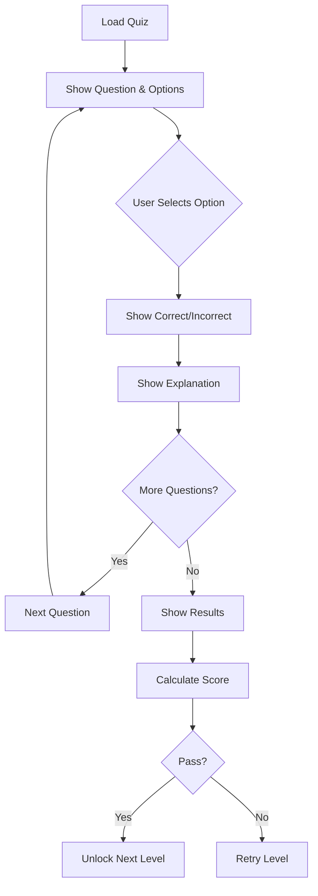

## Overview

The `QuizEntity` class represents a multiple-choice quiz question with four options, a correct answer index, and an explanation. Quiz questions are AI-generated from document content to test comprehension.

**Source:** `lib/features/home/domain/entities/quiz_entity.dart:1`

## Properties

<ParamField path="id" type="String" required>
  Unique identifier for the quiz question
</ParamField>

<ParamField path="question" type="String" required>
  The quiz question text
</ParamField>

<ParamField path="options" type="List<String>" required>
  List of answer options (typically 4 choices)
</ParamField>

<ParamField path="correctIndex" type="int" required>
  Zero-based index of the correct answer in the options list
</ParamField>

<ParamField path="explanation" type="String" required>
  Detailed explanation of why the answer is correct, shown after answering
</ParamField>

## Entity Structure

```dart
class QuizEntity {
  final String id;
  final String question;
  final List<String> options;
  final int correctIndex;
  final String explanation;

  QuizEntity({
    required this.id,
    required this.question,
    required this.options,
    required this.correctIndex,
    required this.explanation,
  });
}
```

<Note>
  `QuizEntity` does not extend `Equatable`. The options list is expected to contain String values.
</Note>

## Model Conversion

### From Supabase Map

**Source:** `lib/features/home/domain/entities/quiz_entity.dart:16`

The entity includes a factory constructor for converting from Supabase data:

```dart
factory QuizEntity.fromMap(Map<String, dynamic> map) {
  return QuizEntity(
    id: map['id'] as String,
    question: map['question_text'] ?? 'Sin pregunta',
    // Supabase returns options as a dynamic list, ensure they are Strings
    options: List<String>.from(map['options'] ?? []),
    correctIndex: map['correct_answer_index'] as int,
    explanation: map['explanation'] ?? '',
  );
}
```

<Note>
  Supabase stores the options as a JSON array, which is converted to a `List<String>`. Default values are provided for missing data.
</Note>

## Database Schema Mapping

| Entity Property | Database Column | Type | Default |
|----------------|-----------------|------|----------|
| `id` | `id` | String | Required |
| `question` | `question_text` | String | "Sin pregunta" |
| `options` | `options` | List String | Empty list |
| `correctIndex` | `correct_answer_index` | int | Required |
| `explanation` | `explanation` | String | Empty string |

## Usage in Repositories

### LevelRepository

**Source:** `lib/features/home/domain/repositories/level_repository.dart:111`

Quizzes are fetched for a specific document and topic:

```dart
Future<List<QuizEntity>> getQuizzes(
  String docId, 
  String topicId
) async {
  try {
    // Try to fetch from the specific topic
    final data = await supabase
      .from('quizzes')
      .select()
      .eq('topic_id', topicId);

    if (data.isNotEmpty) {
      return data.map((json) => QuizEntity.fromMap(json)).toList();
    }

    // Fallback: fetch any quizzes for this document
    final fallbackData = await supabase
      .from('quizzes')
      .select()
      .eq('document_id', docId)
      .limit(10);

    return fallbackData.map((json) => QuizEntity.fromMap(json)).toList();
  } catch (e) {
    throw Exception('Error fetching quizzes: $e');
  }
}
```

<Note>
  Similar to flashcards, the repository implements a fallback strategy to fetch quizzes from the entire document if none exist for the specific topic.
</Note>

## Usage in UI

### QuizPage

**Source:** `lib/features/home/presentation/pages/quiz_page.dart:27`

Quizzes are presented sequentially with answer validation:

```dart
class _QuizPageState extends State<QuizPage> {
  List<QuizEntity> _questions = [];
  int _currentIndex = 0;
  int? _selectedOption;
  bool _hasAnswered = false;
  int _correctAnswers = 0;

  @override
  void initState() {
    super.initState();
    _questions = widget.quizzes;
  }

  void _checkAnswer(int selectedIndex) {
    setState(() {
      _selectedOption = selectedIndex;
      _hasAnswered = true;
      
      if (selectedIndex == _questions[_currentIndex].correctIndex) {
        _correctAnswers++;
      }
    });
  }

  void _nextQuestion() {
    if (_currentIndex < _questions.length - 1) {
      setState(() {
        _currentIndex++;
        _selectedOption = null;
        _hasAnswered = false;
      });
    } else {
      _showResults();
    }
  }
}
```

## Quiz Interaction Flow



## Example Usage

Creating a quiz from Supabase data:

```dart
final quizData = {
  'id': 'quiz_001',
  'question_text': '¿Cuál es la capital de Francia?',
  'options': ['Londres', 'París', 'Madrid', 'Roma'],
  'correct_answer_index': 1,
  'explanation': 'París es la capital de Francia desde el siglo XII.',
};

final quiz = QuizEntity.fromMap(quizData);

print(quiz.question);               // "¿Cuál es la capital de Francia?"
print(quiz.options[quiz.correctIndex]); // "París"
print(quiz.explanation);            // "París es la capital de Francia..."
```

## Answer Validation

```dart
bool checkAnswer(QuizEntity quiz, int userSelectedIndex) {
  return userSelectedIndex == quiz.correctIndex;
}

// Usage
final isCorrect = checkAnswer(quiz, 1); // true
```

## Relationships

- **Level**: Quizzes belong to levels with type `LevelType.quiz`, `LevelType.mixed`, or `LevelType.exam`
- **Topic**: Each quiz question is generated from a specific topic within a document
- **Document**: Quizzes are derived from document content analysis

## AI Generation

Quizzes are automatically generated by AI when a document is uploaded:

1. Document content is analyzed
2. Key concepts and facts are extracted
3. For each topic, multiple quiz questions are generated
4. AI creates plausible distractors (incorrect options)
5. Explanations are generated for each correct answer
6. Quizzes are stored in the `quizzes` table in Supabase

## Scoring System

Typical scoring approach:

```dart
class QuizResults {
  final int totalQuestions;
  final int correctAnswers;
  
  double get percentage => (correctAnswers / totalQuestions) * 100;
  
  bool get passed => percentage >= 70; // 70% passing threshold
  
  int get stars {
    if (percentage >= 90) return 3;
    if (percentage >= 70) return 2;
    return 1;
  }
}
```

## Best Practices

- **Question clarity**: Questions should be unambiguous and test specific knowledge
- **Distractor quality**: Incorrect options should be plausible but clearly wrong to knowledgeable users
- **Explanation depth**: Explanations should teach, not just confirm the answer
- **Option count**: Typically 4 options (1 correct + 3 distractors) for optimal difficulty
- **Index validation**: Always verify `correctIndex` is within bounds of `options` list
