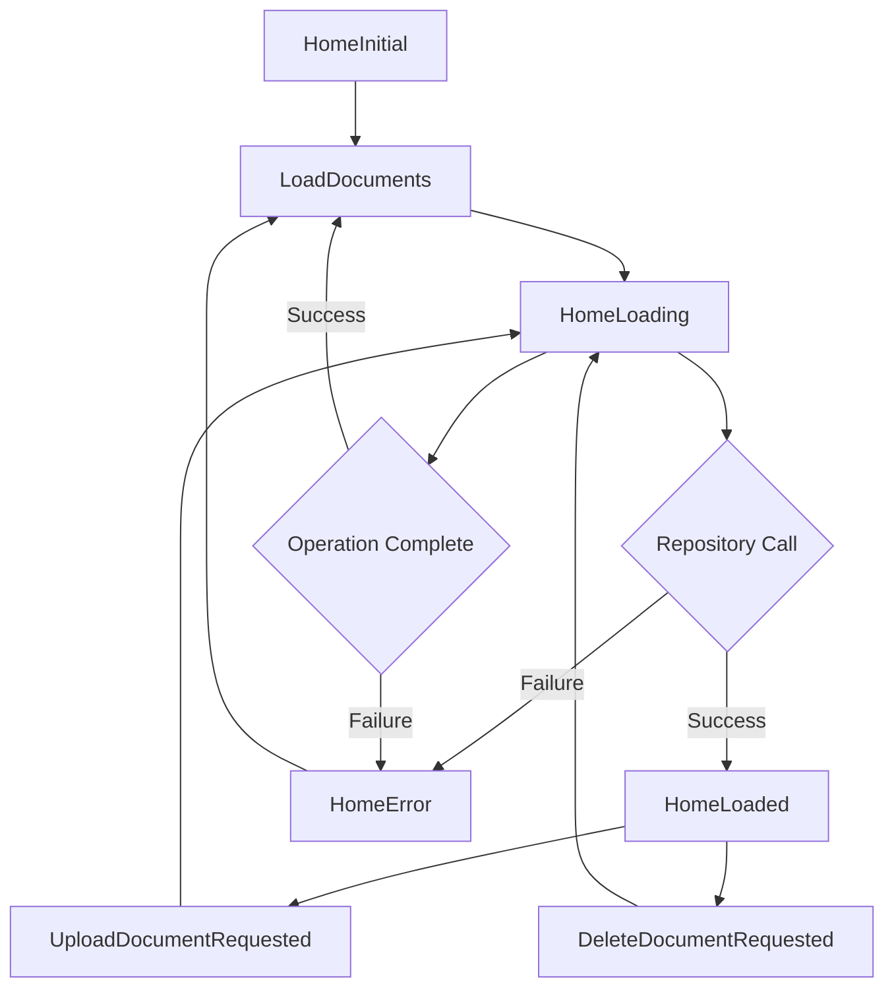

## Overview

The `HomeBloc` manages the state for document operations including loading, uploading, and deleting documents. It also integrates with the auth repository to fetch user profile data.

## Import

```dart
import 'package:flutter_bloc/flutter_bloc.dart';
import 'package:study_quest/features/home/presentation/bloc/home_bloc.dart';
import 'package:study_quest/features/home/domain/repositories/home_repository.dart';
import 'dart:io';
```

## Constructor

```dart
HomeBloc({required HomeRepository homeRepository})
```

<ParamField path="homeRepository" type="HomeRepository" required>
  Repository instance for document operations
</ParamField>

## Events

The `HomeBloc` handles three main events:

### LoadDocuments

Triggered to load all user documents and profile data.

```dart
class LoadDocuments extends HomeEvent {}
```

This event has no parameters.

#### Example

<CodeGroup>

```dart Dispatch Event
context.read<HomeBloc>().add(LoadDocuments());
```

```dart On Page Load
class HomePage extends StatefulWidget {
  @override
  State<HomePage> createState() => _HomePageState();
}

class _HomePageState extends State<HomePage> {
  @override
  void initState() {
    super.initState();
    // Load documents when page opens
    context.read<HomeBloc>().add(LoadDocuments());
  }
  
  @override
  Widget build(BuildContext context) {
    return Scaffold(
      body: BlocBuilder<HomeBloc, HomeState>(
        builder: (context, state) {
          // Handle different states
        },
      ),
    );
  }
}
```

```dart Pull to Refresh
RefreshIndicator(
  onRefresh: () async {
    context.read<HomeBloc>().add(LoadDocuments());
    // Wait for loading state to complete
    await Future.delayed(const Duration(seconds: 1));
  },
  child: DocumentList(),
)
```

</CodeGroup>

---

### UploadDocumentRequested

Triggered when a user uploads a new PDF document.

```dart
class UploadDocumentRequested extends HomeEvent {
  final File file;
  final String fileName;

  const UploadDocumentRequested(this.file, this.fileName);
}
```

<ParamField path="file" type="File" required>
  The PDF file to upload
</ParamField>

<ParamField path="fileName" type="String" required>
  Display name for the document
</ParamField>

#### Example

<CodeGroup>

```dart With File Picker
import 'package:file_picker/file_picker.dart';

Future<void> pickAndUploadFile() async {
  final result = await FilePicker.platform.pickFiles(
    type: FileType.custom,
    allowedExtensions: ['pdf'],
  );

  if (result != null && result.files.single.path != null) {
    final file = File(result.files.single.path!);
    final fileName = result.files.single.name;

    context.read<HomeBloc>().add(
      UploadDocumentRequested(file, fileName),
    );
  }
}
```

```dart Upload Button
FloatingActionButton(
  onPressed: () async {
    final result = await FilePicker.platform.pickFiles(
      type: FileType.custom,
      allowedExtensions: ['pdf'],
    );

    if (result != null) {
      final file = File(result.files.single.path!);
      final fileName = result.files.single.name;

      if (!mounted) return;
      
      context.read<HomeBloc>().add(
        UploadDocumentRequested(file, fileName),
      );
    }
  },
  child: const Icon(Icons.add),
)
```

</CodeGroup>

---

### DeleteDocumentRequested

Triggered when a user deletes a document.

```dart
class DeleteDocumentRequested extends HomeEvent {
  final String documentId;

  const DeleteDocumentRequested(this.documentId);
}
```

<ParamField path="documentId" type="String" required>
  ID of the document to delete
</ParamField>

#### Example

<CodeGroup>

```dart Delete with Confirmation
void confirmDelete(String documentId, String title) {
  showDialog(
    context: context,
    builder: (context) => AlertDialog(
      title: const Text('Delete Document'),
      content: Text('Delete "$title"? This cannot be undone.'),
      actions: [
        TextButton(
          onPressed: () => Navigator.pop(context),
          child: const Text('Cancel'),
        ),
        TextButton(
          onPressed: () {
            Navigator.pop(context);
            context.read<HomeBloc>().add(
              DeleteDocumentRequested(documentId),
            );
          },
          style: TextButton.styleFrom(
            foregroundColor: Colors.red,
          ),
          child: const Text('Delete'),
        ),
      ],
    ),
  );
}
```

```dart Swipe to Delete
Dismissible(
  key: Key(document.id),
  direction: DismissDirection.endToStart,
  background: Container(
    color: Colors.red,
    alignment: Alignment.centerRight,
    padding: const EdgeInsets.only(right: 20),
    child: const Icon(Icons.delete, color: Colors.white),
  ),
  confirmDismiss: (direction) async {
    return await showDialog(
      context: context,
      builder: (context) => AlertDialog(
        title: const Text('Confirm Delete'),
        content: const Text('Delete this document?'),
        actions: [
          TextButton(
            onPressed: () => Navigator.pop(context, false),
            child: const Text('Cancel'),
          ),
          TextButton(
            onPressed: () => Navigator.pop(context, true),
            child: const Text('Delete'),
          ),
        ],
      ),
    );
  },
  onDismissed: (direction) {
    context.read<HomeBloc>().add(
      DeleteDocumentRequested(document.id),
    );
  },
  child: DocumentTile(document: document),
)
```

</CodeGroup>

---

## States

The `HomeBloc` emits four possible states:

### HomeInitial

Initial state before any data is loaded.

```dart
class HomeInitial extends HomeState {}
```

---

### HomeLoading

Emitted during asynchronous operations (loading, uploading, deleting).

```dart
class HomeLoading extends HomeState {}
```

#### Example

```dart
BlocBuilder<HomeBloc, HomeState>(
  builder: (context, state) {
    if (state is HomeLoading) {
      return const Center(
        child: CircularProgressIndicator(),
      );
    }
    // ... other states
  },
)
```

---

### HomeLoaded

Emitted when documents and profile are successfully loaded.

```dart
class HomeLoaded extends HomeState {
  final List<DocumentEntity> documents;
  final dynamic profile; // ProfileEntity or null

  const HomeLoaded(this.documents, {this.profile});
}
```

<ResponseField name="documents" type="List<DocumentEntity>">
  List of user's documents
</ResponseField>

<ResponseField name="profile" type="ProfileEntity?">
  Optional user profile with XP and streak data
</ResponseField>

#### Example

<CodeGroup>

```dart Display Documents
BlocBuilder<HomeBloc, HomeState>(
  builder: (context, state) {
    if (state is HomeLoaded) {
      final documents = state.documents;
      final profile = state.profile;
      
      return Column(
        children: [
          if (profile != null)
            UserProfileHeader(profile: profile),
          Expanded(
            child: ListView.builder(
              itemCount: documents.length,
              itemBuilder: (context, index) {
                return DocumentCard(
                  document: documents[index],
                );
              },
            ),
          ),
        ],
      );
    }
    return const SizedBox();
  },
)
```

```dart Empty State
BlocBuilder<HomeBloc, HomeState>(
  builder: (context, state) {
    if (state is HomeLoaded) {
      if (state.documents.isEmpty) {
        return Center(
          child: Column(
            mainAxisAlignment: MainAxisAlignment.center,
            children: [
              const Icon(
                Icons.upload_file,
                size: 64,
                color: Colors.grey,
              ),
              const SizedBox(height: 16),
              const Text(
                'No documents yet',
                style: TextStyle(fontSize: 18),
              ),
              const SizedBox(height: 8),
              const Text(
                'Upload a PDF to start learning',
                style: TextStyle(color: Colors.grey),
              ),
              const SizedBox(height: 16),
              ElevatedButton(
                onPressed: () => pickAndUploadFile(),
                child: const Text('Upload PDF'),
              ),
            ],
          ),
        );
      }
      
      return DocumentList(documents: state.documents);
    }
    return const SizedBox();
  },
)
```

```dart Filter by Status
BlocBuilder<HomeBloc, HomeState>(
  builder: (context, state) {
    if (state is HomeLoaded) {
      final readyDocs = state.documents
          .where((doc) => doc.status == 'ready')
          .toList();
      
      final processingDocs = state.documents
          .where((doc) => doc.status == 'processing')
          .toList();
      
      return Column(
        children: [
          if (processingDocs.isNotEmpty) ..[
            const Text('Processing'),
            ...processingDocs.map((doc) => ProcessingCard(doc)),
          ],
          if (readyDocs.isNotEmpty) ..[
            const Text('Ready'),
            ...readyDocs.map((doc) => DocumentCard(doc)),
          ],
        ],
      );
    }
    return const SizedBox();
  },
)
```

</CodeGroup>

---

### HomeError

Emitted when an operation fails.

```dart
class HomeError extends HomeState {
  final String message;

  const HomeError(this.message);
}
```

<ResponseField name="message" type="String">
  Error message describing what went wrong
</ResponseField>

#### Example

<CodeGroup>

```dart Error Display
BlocBuilder<HomeBloc, HomeState>(
  builder: (context, state) {
    if (state is HomeError) {
      return Center(
        child: Column(
          mainAxisAlignment: MainAxisAlignment.center,
          children: [
            const Icon(
              Icons.error_outline,
              size: 64,
              color: Colors.red,
            ),
            const SizedBox(height: 16),
            Text(
              state.message,
              style: const TextStyle(color: Colors.red),
              textAlign: TextAlign.center,
            ),
            const SizedBox(height: 16),
            ElevatedButton(
              onPressed: () {
                context.read<HomeBloc>().add(LoadDocuments());
              },
              child: const Text('Retry'),
            ),
          ],
        ),
      );
    }
    return const SizedBox();
  },
)
```

```dart Error SnackBar
BlocListener<HomeBloc, HomeState>(
  listener: (context, state) {
    if (state is HomeError) {
      ScaffoldMessenger.of(context).showSnackBar(
        SnackBar(
          content: Text(state.message),
          backgroundColor: Colors.red,
          action: SnackBarAction(
            label: 'Retry',
            textColor: Colors.white,
            onPressed: () {
              context.read<HomeBloc>().add(LoadDocuments());
            },
          ),
        ),
      );
    }
  },
  child: YourWidget(),
)
```

</CodeGroup>

---

## Complete Usage Example

<CodeGroup>

```dart Home Page
class HomePage extends StatefulWidget {
  @override
  State<HomePage> createState() => _HomePageState();
}

class _HomePageState extends State<HomePage> {
  @override
  void initState() {
    super.initState();
    context.read<HomeBloc>().add(LoadDocuments());
  }

  Future<void> pickAndUploadFile() async {
    final result = await FilePicker.platform.pickFiles(
      type: FileType.custom,
      allowedExtensions: ['pdf'],
    );

    if (result != null && result.files.single.path != null) {
      final file = File(result.files.single.path!);
      final fileName = result.files.single.name;

      if (!mounted) return;

      context.read<HomeBloc>().add(
        UploadDocumentRequested(file, fileName),
      );
    }
  }

  @override
  Widget build(BuildContext context) {
    return Scaffold(
      appBar: AppBar(
        title: const Text('My Documents'),
      ),
      body: BlocConsumer<HomeBloc, HomeState>(
        listener: (context, state) {
          if (state is HomeError) {
            ScaffoldMessenger.of(context).showSnackBar(
              SnackBar(
                content: Text(state.message),
                backgroundColor: Colors.red,
              ),
            );
          }
        },
        builder: (context, state) {
          if (state is HomeLoading) {
            return const Center(
              child: CircularProgressIndicator(),
            );
          }

          if (state is HomeLoaded) {
            if (state.documents.isEmpty) {
              return Center(
                child: Column(
                  mainAxisAlignment: MainAxisAlignment.center,
                  children: [
                    const Icon(
                      Icons.upload_file,
                      size: 64,
                      color: Colors.grey,
                    ),
                    const SizedBox(height: 16),
                    const Text('No documents yet'),
                    const SizedBox(height: 16),
                    ElevatedButton(
                      onPressed: pickAndUploadFile,
                      child: const Text('Upload PDF'),
                    ),
                  ],
                ),
              );
            }

            return RefreshIndicator(
              onRefresh: () async {
                context.read<HomeBloc>().add(LoadDocuments());
                await Future.delayed(const Duration(seconds: 1));
              },
              child: ListView.builder(
                itemCount: state.documents.length,
                itemBuilder: (context, index) {
                  final doc = state.documents[index];
                  return DocumentCard(
                    document: doc,
                    onDelete: () {
                      showDialog(
                        context: context,
                        builder: (context) => AlertDialog(
                          title: const Text('Delete Document'),
                          content: Text(
                            'Delete "${doc.title}"?',
                          ),
                          actions: [
                            TextButton(
                              onPressed: () => Navigator.pop(context),
                              child: const Text('Cancel'),
                            ),
                            TextButton(
                              onPressed: () {
                                Navigator.pop(context);
                                context.read<HomeBloc>().add(
                                  DeleteDocumentRequested(doc.id),
                                );
                              },
                              child: const Text('Delete'),
                            ),
                          ],
                        ),
                      );
                    },
                  );
                },
              ),
            );
          }

          return const Center(
            child: Text('Something went wrong'),
          );
        },
      ),
      floatingActionButton: FloatingActionButton(
        onPressed: pickAndUploadFile,
        child: const Icon(Icons.add),
      ),
    );
  }
}
```

</CodeGroup>

## State Flow



## Best Practices

<AccordionGroup>
  <Accordion title="Provide HomeBloc at app level">
    Share the HomeBloc across pages that need document access.
    
    ```dart
    BlocProvider(
      create: (context) => HomeBloc(
        homeRepository: getIt<HomeRepository>(),
      ),
      child: MaterialApp(
        home: HomePage(),
      ),
    )
    ```
  </Accordion>

  <Accordion title="Handle file permissions">
    Always check for storage permissions before file operations.
    
    ```dart
    import 'package:permission_handler/permission_handler.dart';
    
    Future<void> uploadFile() async {
      final status = await Permission.storage.request();
      
      if (status.isGranted) {
        // Proceed with file picker
      } else {
        showError('Storage permission required');
      }
    }
    ```
  </Accordion>

  <Accordion title="Show upload progress">
    Provide feedback during uploads for better UX.
    
    ```dart
    BlocBuilder<HomeBloc, HomeState>(
      builder: (context, state) {
        if (state is HomeLoading) {
          return const Column(
            children: [
              CircularProgressIndicator(),
              SizedBox(height: 8),
              Text('Uploading...'),
            ],
          );
        }
        // ... other states
      },
    )
    ```
  </Accordion>
</AccordionGroup>

## Related Pages

<CardGroup cols={2}>
  <Card title="Home Overview" icon="house" href="/api/home/overview">
    Feature architecture and entities
  </Card>
  <Card title="Home Repository" icon="database" href="/api/home/repositories">
    Repository methods and operations
  </Card>
</CardGroup>