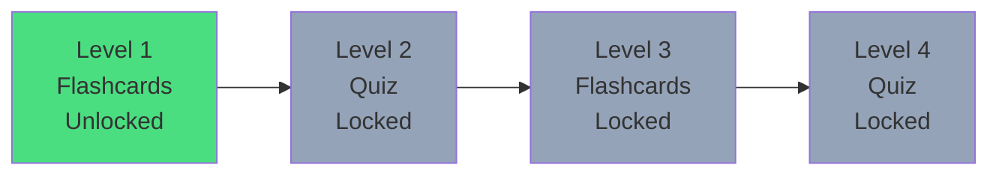

## Overview

The Home feature manages document uploads, learning levels, flashcards, and quizzes in StudyQuest. It implements the core learning experience with AI-generated content from uploaded PDFs.

## Architecture

The Home feature follows Clean Architecture principles:

### Domain Layer
Defines core business logic:
- **Entities**: `DocumentEntity`, `LevelEntity`, `FlashcardEntity`, `QuizEntity`
- **Repositories**: `HomeRepository`, `LevelRepository`

### Data Layer
Implements data operations:
- **Data Sources**: `HomeRemoteDataSource`
- **Models**: `DocumentModel`, `LevelModel`
- **Repository Implementations**: `HomeRepositoryImpl`

### Presentation Layer
Handles UI and state:
- **BLoC**: `HomeBloc`, `LevelBloc` with events and states
- **Pages**: `HomePage`, `LevelMapPage`, `FlashcardsPage`

## Core Entities

### DocumentEntity

Represents an uploaded PDF document with AI-generated content.

<ParamField path="id" type="String" required>
  Unique identifier for the document
</ParamField>

<ParamField path="title" type="String" required>
  Document title (usually filename)
</ParamField>

<ParamField path="fileUrl" type="String" required>
  URL to the uploaded PDF file
</ParamField>

<ParamField path="summary" type="String?">
  AI-generated summary (null if still processing)
</ParamField>

<ParamField path="status" type="String" required>
  Processing status: `'processing'`, `'ready'`, or `'error'`
</ParamField>

<ParamField path="uploadDate" type="DateTime" required>
  Timestamp when the document was uploaded
</ParamField>

---

### LevelEntity

Represents a learning level or topic within a document.

<ParamField path="id" type="String" required>
  Unique identifier for the level
</ParamField>

<ParamField path="title" type="String" required>
  Level title (e.g., "Conceptos Clave")
</ParamField>

<ParamField path="type" type="LevelType" required>
  Type of level: `flashcards`, `quiz`, `mixed`, or `exam`
</ParamField>

<ParamField path="isLocked" type="bool" default="false">
  Whether the level is locked (requires previous level completion)
</ParamField>

<ParamField path="isCompleted" type="bool" default="false">
  Whether the user has completed this level
</ParamField>

<ParamField path="difficulty" type="int" default="1">
  Difficulty rating (1-5 stars)
</ParamField>

---

### FlashcardEntity

Represents a study flashcard with question and answer.

<ParamField path="id" type="String" required>
  Unique identifier for the flashcard
</ParamField>

<ParamField path="front" type="String" required>
  Question or prompt text
</ParamField>

<ParamField path="back" type="String" required>
  Answer or explanation text
</ParamField>

#### Factory Method

```dart
factory FlashcardEntity.fromMap(Map<String, dynamic> map)
```

Creates a FlashcardEntity from a database map.

---

### QuizEntity

Represents a multiple-choice quiz question.

<ParamField path="id" type="String" required>
  Unique identifier for the quiz question
</ParamField>

<ParamField path="question" type="String" required>
  The quiz question text
</ParamField>

<ParamField path="options" type="List<String>" required>
  List of answer options
</ParamField>

<ParamField path="correctIndex" type="int" required>
  Index of the correct answer in the options list
</ParamField>

<ParamField path="explanation" type="String" required>
  Explanation of the correct answer
</ParamField>

#### Factory Method

```dart
factory QuizEntity.fromMap(Map<String, dynamic> map)
```

Creates a QuizEntity from a database map.

---

## Usage Examples

<CodeGroup>

```dart Working with Documents
import 'package:study_quest/features/home/domain/entities/document_entity.dart';

// Check document status
if (document.status == 'ready') {
  print('Document ready: ${document.title}');
  print('Summary: ${document.summary}');
} else if (document.status == 'processing') {
  print('AI is still processing this document...');
}

// Format upload date
final formattedDate = DateFormat('MMM dd, yyyy')
    .format(document.uploadDate);
```

```dart Working with Levels
import 'package:study_quest/features/home/domain/entities/level_entity.dart';

// Check if level is accessible
if (!level.isLocked) {
  // User can access this level
  if (level.type == LevelType.flashcards) {
    Navigator.push(
      context,
      MaterialPageRoute(
        builder: (context) => FlashcardsPage(
          documentId: docId,
          topicId: level.id,
        ),
      ),
    );
  } else if (level.type == LevelType.quiz) {
    Navigator.push(
      context,
      MaterialPageRoute(
        builder: (context) => QuizPage(
          documentId: docId,
          topicId: level.id,
        ),
      ),
    );
  }
} else {
  showDialog(
    context: context,
    builder: (context) => AlertDialog(
      title: const Text('Level Locked'),
      content: const Text(
        'Complete the previous level to unlock this one!',
      ),
    ),
  );
}
```

```dart Working with Flashcards
import 'package:study_quest/features/home/domain/entities/flashcard_entity.dart';

// Create flashcard from API response
final flashcard = FlashcardEntity.fromMap({
  'id': 'card_123',
  'front_text': '¿Qué es Clean Architecture?',
  'back_text': 'Un patrón de diseño que separa la lógica...',
});

// Display in UI
Card(
  child: Column(
    children: [
      Text(flashcard.front, style: TextStyle(fontSize: 18)),
      ElevatedButton(
        onPressed: () => setState(() => showBack = true),
        child: const Text('Reveal Answer'),
      ),
      if (showBack)
        Text(flashcard.back),
    ],
  ),
)
```

```dart Working with Quizzes
import 'package:study_quest/features/home/domain/entities/quiz_entity.dart';

// Create quiz from API response
final quiz = QuizEntity.fromMap({
  'id': 'quiz_123',
  'question_text': '¿Cuál es el propósito de un Repository?',
  'options': [
    'Manejar la UI',
    'Abstraer el origen de datos',
    'Validar formularios',
    'Navegar entre pantallas',
  ],
  'correct_answer_index': 1,
  'explanation': 'El Repository abstrae el origen de datos...',
});

// Check answer
void checkAnswer(int selectedIndex) {
  if (selectedIndex == quiz.correctIndex) {
    print('Correct!');
    print('Explanation: ${quiz.explanation}');
  } else {
    print('Incorrect. Try again!');
  }
}
```

</CodeGroup>

## Level Progression System

Levels follow a sequential unlock pattern:

1. **Level 1** is always unlocked
2. Each subsequent level unlocks when the previous one is completed
3. Levels alternate between flashcards and quizzes
4. Completing levels awards XP to the user



## Features

<CardGroup cols={2}>
  <Card title="PDF Upload" icon="file-arrow-up">
    Upload PDFs and let AI generate learning content
  </Card>
  <Card title="Dynamic Levels" icon="layer-group">
    AI-generated topics with progressive unlocking
  </Card>
  <Card title="Flashcards" icon="cards-blank">
    Study with AI-generated flashcards
  </Card>
  <Card title="Quizzes" icon="circle-question">
    Test knowledge with multiple-choice quizzes
  </Card>
  <Card title="Progress Tracking" icon="chart-line">
    Track completion and earn XP
  </Card>
  <Card title="Document Management" icon="folder-open">
    View, manage, and delete uploaded documents
  </Card>
</CardGroup>

## Related Pages

<Card title="Home Repository" icon="database" href="/api/home/repositories">
  Learn about repository methods for documents and levels
</Card>

<Card title="Home BLoC" icon="diagram-project" href="/api/home/bloc">
  Explore state management for the home feature
</Card>