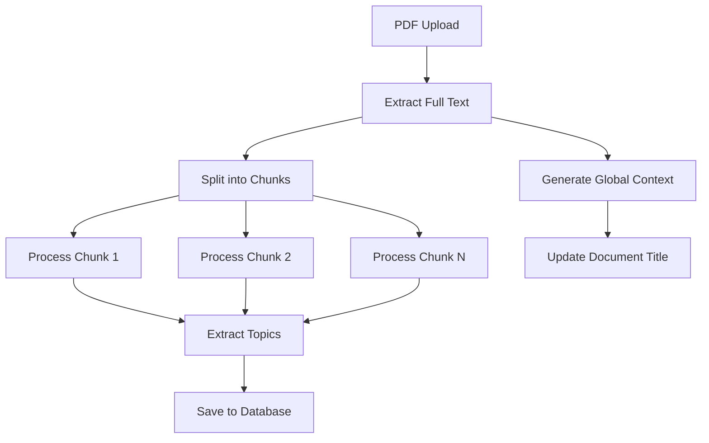

## Overview

StudyQuest uses **Google Gemini 2.5-flash** to analyze PDF content and automatically generate high-quality educational materials. The AI acts as a "rigorous university professor" to extract key concepts, create flashcards, and design multiple-choice quizzes.

## Model Selection

We use `gemini-2.5-flash` for its excellent JSON instruction-following capabilities:

```python worker.py
genai.configure(api_key=GEMINI_API_KEY)
model = genai.GenerativeModel('gemini-2.5-flash')
```

### Why Gemini 2.5-flash?

- **Structured Output:** Reliably returns valid JSON with complex nested structures
- **Fast Processing:** Low latency for real-time document processing
- **Cost-Effective:** Lower cost per token compared to larger models
- **Long Context:** Handles 25,000+ character chunks effectively

<Note>
  You can experiment with other models like `gemini-1.5-pro` for more complex analysis, but may incur higher API costs.
</Note>

## AI Architecture

The AI integration consists of two main functions:

1. **Global Context Generation** - Creates world titles and summaries
2. **Chunk Content Analysis** - Generates topics, flashcards, and quizzes

### Flow Diagram



## Prompt Engineering

### Global Context Prompt (worker.py:103-123)

Generates an engaging title and summary by analyzing the beginning and end of the document:

```python
def generate_global_context(full_text):
    print("   📝 Generando título corto y resumen global...")
    prompt = f"""
    Lee el inicio y el final de este documento.
    1. Crea un título corto, épico y atractivo (máximo 4 palabras) para este "mundo" de estudio basado en el tema principal (ej. "Redes Cisco", "Ciberseguridad Básica", "Anatomía Humana").
    2. Escribe un resumen de 2 a 3 oraciones motivadoras.
    
    Devuelve SOLO un JSON con este formato exacto:
    {{
        "short_title": "Nombre Corto del Mundo",
        "summary": "Resumen motivador de lo que aprenderá."
    }}
    
    Inicio del documento:
    {full_text[:4000]}
    
    ...
    
    Final del documento:
    {full_text[-4000:]}
    """
```

**Key Design Choices:**

- **First + Last 4000 chars:** Captures introduction and conclusion without exceeding context limits
- **4-word limit:** Ensures concise, memorable world names
- **Motivational tone:** Increases student engagement
- **JSON-only response:** Prevents AI from adding explanatory text

<Warning>
  If the AI returns malformed JSON, the fallback title is "Mundo Inexplorado" (worker.py:132).
</Warning>

### Content Generation Prompt (worker.py:46-86)

The core prompt that transforms text chunks into structured educational content:

```python
prompt = f"""
Actúa como un profesor universitario riguroso. Analiza esta sección extraída de un material de estudio.

--- COMIENZO SECCIÓN ---
{chunk_text} 
--- FIN SECCIÓN ---

Tu tarea es extraer los conceptos clave de esta sección específica y crear material de estudio. 
Dependiendo de la cantidad de información en esta sección, crea entre 1 y 3 Temas ("topics").

Reglas estrictas para el JSON:
1. Si no hay información relevante en este texto (ej. es un índice o bibliografía), devuelve "topics": []
2. Cada tema debe tener entre 3 y 5 flashcards con conceptos CRUCIALES.
3. Cada tema debe tener entre 2 y 4 quizzes (opción múltiple, 4 opciones).
4. Las opciones de los quizzes no deben ser obvias, incluye distractores creíbles.
5. Solo responde con el JSON puro, sin comillas Markdown de código (```json).

Formato esperado:
{{
    "topics": [
        {{
            "title": "Nombre del Tema (Específico, no general)",
            "description": "Breve descripción de lo que trata este tema.",
            "flashcards": [
                {{"front": "Concepto o Pregunta directa", "back": "Definición clara y concisa"}}
            ],
            "quizzes": [
                {{
                    "question": "Pregunta analítica sobre el tema",
                    "options": ["A", "B", "C", "D"],
                    "correct_index": 0,
                    "explanation": "Por qué es correcta."
                }}
            ]
        }}
    ]
}}
"""
```

## Prompt Engineering Techniques

### 1. Role-Playing

```
Actúa como un profesor universitario riguroso.
```

Sets the AI's persona to ensure academic rigor and appropriate difficulty level.

### 2. Explicit Constraints

```
1-3 Temas por chunk
3-5 flashcards por tema
2-4 quizzes por tema
```

Prevents over-generation and ensures consistent content density.

### 3. Edge Case Handling

```
Si no hay información relevante (índice o bibliografía), devuelve "topics": []
```

Prevents AI from creating flashcards for non-educational content.

### 4. Quality Guidelines

```
Las opciones de los quizzes no deben ser obvias, incluye distractores creíbles.
```

Ensures quizzes are challenging and pedagogically sound.

### 5. Format Enforcement

```
Solo responde con el JSON puro, sin comillas Markdown de código (```json).
```

Reduces parsing errors by preventing common AI formatting mistakes.

<Note>
  Despite this instruction, the AI sometimes adds markdown code blocks. We handle this with robust JSON cleaning (worker.py:91-95).
</Note>

## JSON Parsing & Cleaning

The AI response requires defensive parsing due to occasional formatting issues:

```python worker.py:88-100
try:
    response = model.generate_content(prompt)
    # Limpieza robusta del JSON por si la IA añade markdown
    clean_text = response.text.replace("```json", "").replace("```", "").strip()
    # A veces la IA añade texto extra antes o después de las llaves
    start_idx = clean_text.find('{')
    end_idx = clean_text.rfind('}') + 1
    clean_text = clean_text[start_idx:end_idx]
    
    return json.loads(clean_text)
except Exception as e:
    print(f"     ⚠️ Advertencia: IA falló en parsear el bloque {chunk_index}: {e}")
    return {"topics": []}
```

### Cleaning Steps

1. **Remove markdown fences:** Strips `\`\`\`json` and `\`\`\``
2. **Find JSON boundaries:** Extracts content between first `{` and last `}`
3. **Parse JSON:** Attempts `json.loads()`
4. **Graceful degradation:** Returns empty topics array on failure

<Warning>
  If multiple chunks fail to parse, the document may have very few topics. Monitor AI parsing failure rates in logs.
</Warning>

## Rate Limiting & Quotas

Google AI Studio has rate limits on API requests:

### Rate Limit Strategy (worker.py:161)

```python
for i, chunk in enumerate(chunks):
    if i > 0: time.sleep(2)  # 2-second delay between chunks
    ai_data = generate_content_for_chunk(chunk, i + 1)
```

**Why 2 seconds?**
- Prevents hitting Gemini's requests-per-minute quota
- Allows database writes to complete between chunks
- Minimal impact on total processing time (most time is in AI inference)

### Quota Best Practices

<Steps>
  <Step title="Monitor usage in Google AI Studio">
    Check your API usage dashboard regularly:
    https://aistudio.google.com/app/apikey
  </Step>

  <Step title="Set up quota alerts">
    Configure billing alerts to avoid unexpected API cutoffs.
  </Step>

  <Step title="Adjust delay if needed">
    Increase `time.sleep(2)` to `time.sleep(5)` if you hit rate limits.
  </Step>
</Steps>

## Response Validation

The worker validates AI-generated content before saving:

```python worker.py:166-169
for topic in ai_data['topics']:
    # Solo guardamos temas que realmente tengan contenido
    if len(topic.get('flashcards', [])) > 0 or len(topic.get('quizzes', [])) > 0:
        all_topics.append(topic)
```

This prevents saving empty topics that would appear broken in the frontend.

## Cost Estimation

Gemini 2.5-flash pricing (as of 2026):

- **Input tokens:** $0.01 per 1M tokens
- **Output tokens:** $0.04 per 1M tokens

### Example Calculation

For a 50-page PDF (~25,000 words = ~33,000 tokens):

```
Input cost:  33,000 tokens × $0.01 / 1M = $0.00033
Output cost: ~5,000 tokens × $0.04 / 1M = $0.00020
Total: ~$0.0005 per document
```

<Note>
  Processing 1,000 documents would cost approximately **$0.50** in API fees.
</Note>

## Improving AI Output Quality

### Experiment with Temperature

Add temperature control for more/less creative responses:

```python
generation_config = genai.GenerationConfig(
    temperature=0.7,  # Lower = more deterministic
    top_p=0.9,
    top_k=40
)

response = model.generate_content(
    prompt,
    generation_config=generation_config
)
```

### Use Few-Shot Examples

Add example topics to the prompt:

```python
prompt = f"""
...

Ejemplo de salida esperada:
{{
    "topics": [
        {{
            "title": "Modelo OSI - Capa de Red",
            "description": "Funciones y protocolos de la capa 3 del modelo OSI.",
            "flashcards": [
                {{"front": "¿Qué protocolo se usa para enrutamiento?", "back": "IP (Internet Protocol)"}}
            ],
            "quizzes": [
                {{
                    "question": "¿Cuál es la función principal de la capa de red?",
                    "options": ["Enrutamiento", "Control de flujo", "Cifrado", "Compresión"],
                    "correct_index": 0,
                    "explanation": "La capa de red se encarga del enrutamiento de paquetes."
                }}
            ]
        }}
    ]
}}
"""
```

### Validate Output Schema

Add schema validation using `pydantic`:

```python
from pydantic import BaseModel, ValidationError
from typing import List

class Flashcard(BaseModel):
    front: str
    back: str

class Quiz(BaseModel):
    question: str
    options: List[str]
    correct_index: int
    explanation: str

class Topic(BaseModel):
    title: str
    description: str
    flashcards: List[Flashcard]
    quizzes: List[Quiz]

try:
    validated = Topic(**topic_data)
except ValidationError as e:
    print(f"Invalid topic schema: {e}")
```

## Troubleshooting AI Issues

| Issue | Cause | Solution |
|-------|-------|----------|
| Empty `topics` array | Chunk contains non-educational content | Expected behavior, AI correctly skips indices/bibliographies |
| JSON parsing failures | AI added extra text or markdown | Increase cleaning logic robustness or adjust prompt |
| Generic flashcards | Prompt not specific enough | Add few-shot examples or increase temperature |
| Quizzes too easy | Distractor options not challenging | Emphasize "credible distractors" in prompt |
| API quota exceeded | Too many requests per minute | Increase `time.sleep()` delay or upgrade quota |
| Low-quality topics | Wrong model used | Ensure using `gemini-2.5-flash` not older versions |

## Next Steps

<CardGroup cols={2}>
  <Card title="PDF Processing" icon="file-pdf" href="/dev/backend/pdf-processing">
    Learn about text extraction and chunking strategies
  </Card>
  <Card title="Supabase Configuration" icon="database" href="/dev/supabase-configuration">
    Understand how AI-generated content is stored in Supabase
  </Card>
</CardGroup>